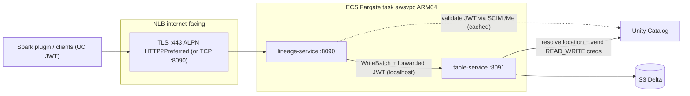

# terraform/ecs-lineage

Deploys the open-lineage stack to **AWS ECS Fargate**: the Go `lineage-service`
(ConnectRPC) and the Rust `table-service` run as **two containers in one task**
(sidecar pattern, sharing `localhost`), fronted by an internet-facing **Network
Load Balancer**.



## Why an NLB (not an ALB)

The lineage service speaks ConnectRPC over HTTP/2 (h2c). An NLB is L4, so it
passes HTTP/2 through cleanly. With a domain configured it terminates TLS on
`:443` (ALPN `HTTP2Preferred`, so both h2 and HTTP/1.1 clients negotiate) and
forwards plaintext to the container; without a domain it forwards raw TCP on the
lineage port. This mirrors the `spark-ecs` Spark Connect pattern.

## Auth + Unity Catalog

- `lineage_auth_mode = uc-jwt` (default): the lineage service validates inbound
  `Authorization: Bearer <JWT>` by calling UC `GET /api/1.0/unity-control/scim2/Me`
  (cached for 60s). `static` compares against `lineage_auth_token`; `disabled`
  skips auth (local only).
- The caller's JWT is forwarded to the `table-service`, which uses it to vend
  `READ_WRITE` credentials from UC and write the UC-managed Delta table. When no
  per-user token is present it falls back to `unity_catalog_token`.

## Deploy

Config is driven from the repo-root `.env` (copy from `.env.example`). The
deploy script sources `.env` and exports `TF_VAR_*`.

```bash
# from the repo root
cp .env.example .env   # then edit AWS_REGION, UNITY_CATALOG_URL, tags, etc.

# build + push both images and apply Terraform
just deploy-ecs-lineage
# or
make deploy-ecs-lineage
# or directly, with knobs:
DEPLOY_AUTO_APPROVE=1 scripts/deploy-ecs-lineage.sh v0.2.0 v0.3.0
```

Useful knobs: `DEPLOY_SKIP_BUILD=1` (reuse pushed images),
`DEPLOY_AUTO_APPROVE=1` (non-interactive apply).

## Versioning

Each service has an **independent image tag** (`LINEAGE_IMAGE_TAG`,
`TABLE_IMAGE_TAG`). The tag is baked into each binary at build time
(`-ldflags -X main.version` for Go; `SERVICE_VERSION` build arg for Rust) and
surfaced on `GET /health` as `{"status":"ok","version":"..."}`.

## ECR

Repositories are created on first push by `scripts/ecr-push-*.sh`; Terraform
only references them via `data.aws_ecr_repository`.

## State

Local state by default. For shared/remote state, copy
`backend.s3.tf.example` to `backend.tf`, set the bucket, and
`terraform -chdir=terraform/ecs-lineage init -migrate-state`.

## Destroy

```bash
just ecs-lineage-destroy
```
